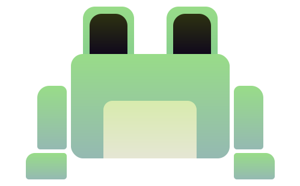

# Scribbit

### Implicit where convenient, verbose where it counts.

A very feature incomplete language I'm making both for fun and to learn more about compilers.

## Fundamentals

1. Staticly & strongly typed.
2. Support for both proceedural and object oriented design patterns.

# Made with [LLVM](https://llvm.org/).

